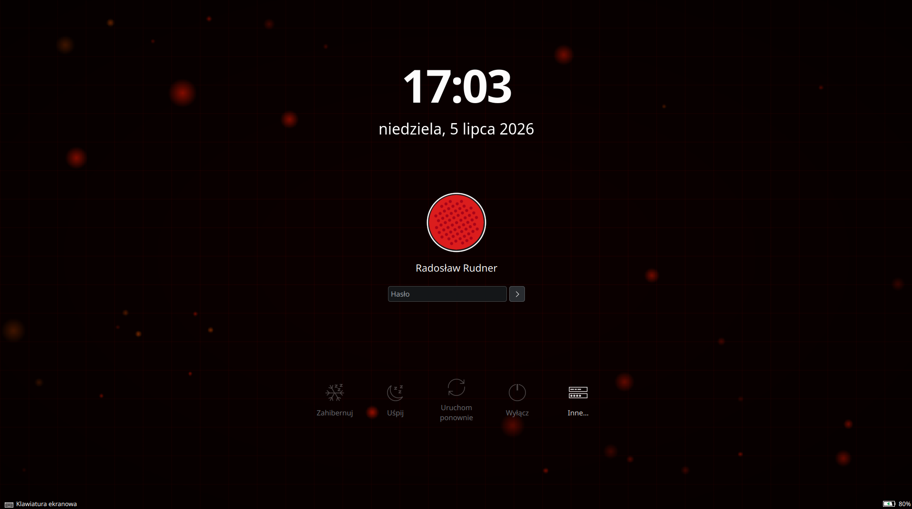

# plasma-css-wallpaper

A KDE Plasma 6 wallpaper plugin that lets you use any **HTML/CSS/JS** file as your desktop wallpaper.



## Features

- Full HTML5, CSS3 and JavaScript support (powered by QtWebEngine / Chromium)
- Select from multiple animations via the settings dropdown
- Add your own animations by dropping `.html` files into the wallpapers folder
- Works on both **Wayland** and X11
- Non-interactive by design: input passes through to the desktop, so icon rubber-band selection keeps working
- Adjustable render resolution and target FPS to trade visual fidelity for GPU usage

## Requirements

- KDE Plasma 6.0+
- `qt6-webengine`

## Installation

### Manual

```bash
git clone https://github.com/rrudner/plasma-css-wallpaper
cd plasma-css-wallpaper
chmod +x install.sh
./install.sh
```

Then right-click your desktop → **Configure Desktop and Wallpaper** → select **CSS Wallpaper**.

## Adding your own animations

Drop any `.html` file into:

```
~/.local/share/plasma/wallpapers/io.github.rrudner.plasmacsswallpaper/contents/html/
```

It will appear automatically in the settings dropdown — no restart required.

If your animation reads `window.innerWidth`/`innerHeight` or otherwise depends on
viewport size, note that the page is reloaded whenever render resolution changes
(see below), so those values stay in sync automatically.

**[`template.html`](template.html)** at the repo root is a documented starting
point for new animations — copy it into `contents/html/`, rename it, and read
the comments. It covers the three conventions below in a working example:
scale-compensated sizing, FPS throttling, and a frozen "init frame".

## GPU usage: render resolution & FPS

Continuous animations inside a `WebEngineView` force Chromium to produce and hand
off a new frame every vsync, which is the dominant GPU cost — not how complex the
animation actually is. Two settings in the wallpaper configuration let you trade
visual fidelity for GPU usage:

- **Render resolution** — renders the page at a fraction of the screen's native
  pixel size, then lets Qt Quick scale the result back up (a cheap GPU blit).
  Lower values cut the pixel count Chromium has to rasterize/composite every frame.
- **Target FPS** — type any value (not locked to a preset list, so e.g. 144Hz
  displays are supported). Animations that respect the `?fps=` URL parameter
  (like `thinkpad-ambient.html`) throttle their own update rate accordingly,
  skipping frames where nothing changes instead of recompositing 60 times a second
  for no visual benefit.

### Freeze (battery saver)

A **Freeze** checkbox in the settings asks the current animation to go fully
static — the `?frozen=1` URL parameter described above and in `template.html`.
It engages automatically whenever the system's power profile (via
`power-profiles-daemon`) is set to **power-saver**, in addition to the manual
checkbox. An animation that respects `frozen` keeps showing its static "init
frame" (see `template.html`) at near-zero GPU cost instead of the whole
wallpaper going flat black; one that ignores it just keeps animating.

That auto-detection uses a private KDE API (the same one behind the built-in
battery monitor applet), since there's no stable public QML interface for
reading the active power profile. It's not guaranteed to keep working across
future Plasma releases — if it ever silently stops detecting the profile, the
manual checkbox still works regardless.

## Login screen and lock screen

The animations can also be used as the SDDM login screen background and the
lock screen background, though both are separate mechanisms from the desktop
wallpaper plugin:

- **Lock screen** - kscreenlocker shares the same Wallpaper plugin system as
  the desktop, so it just needs pointing at this plugin in
  `~/.config/kscreenlockerrc`:
  ```ini
  [Greeter]
  WallpaperPlugin=com.user.csswallpaper

  [Greeter][Wallpaper][com.user.csswallpaper][General]
  HtmlFile=thinkpad-ambient.html
  RenderScale=100
  FrameRate=60
  ```
  Test safely without locking the session: `/usr/lib/kscreenlocker_greet --testing`

- **SDDM** is a separate display manager with its own theme format that
  doesn't understand Plasma wallpaper plugins at all, so `sddm-theme/` is a
  full greeter theme (based on Breeze) with a `WebEngineView` embedded in its
  background component. Install it with:
  ```bash
  sudo ./install-sddm-theme.sh      # installs to /usr/share/sddm/themes/css-wallpaper
                                     # and sets it as the active SDDM theme
  sudo ./uninstall-sddm-theme.sh    # reverts
  ```
  Animation/FPS/render-resolution live in that theme's own `theme.conf`
  (`webBackground=`, `webFps=`, `webScale=`). Test safely without logging out:
  `sddm-greeter-qt6 --test-mode --theme /usr/share/sddm/themes/css-wallpaper`

  SDDM's own KCM (System Settings -> Login Screen) can silently write
  `type=color` into that theme's `theme.conf.user`, which overrides
  `theme.conf` and replaces the animation with a flat color background. If
  that happens, re-run the sync script below, which resets it.

Since both of these are configured independently of the desktop wallpaper
(and of each other), **`./sync-login-wallpaper.sh`** copies whatever
animation/scale/FPS is currently set on the desktop to both of them in one
step, rather than editing each by hand:
```bash
./sync-login-wallpaper.sh                    # uses the first desktop found
./sync-login-wallpaper.sh <containment-id>   # or target a specific screen
```

## Included examples

| File | Description |
|---|---|
| `aquarium.html` | Sunlit tank with swimming fish, plants, rocks and filter bubbles; respects `?fps=`, `?scale=` and `?frozen=` |
| `deep-ocean.html` | Deep-sea gradient with rising bubbles; respects `?fps=`, `?scale=` and `?frozen=` |
| `matrix.html` | Classic terminal-style falling code grid; respects `?fps=`, `?scale=` and `?frozen=` |
| `thinkpad-ambient.html` | Dim red/orange ambient embers with a subtle grid and vignette; respects `?fps=`, `?scale=` and `?frozen=` |

## Uninstall

```bash
./uninstall.sh
```

## License

GPL-2.0-or-later
