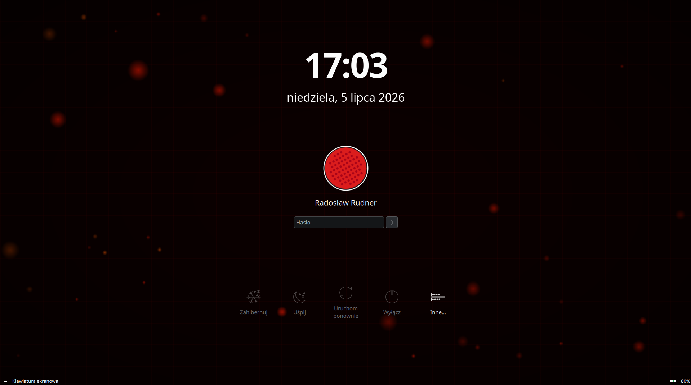

# plasma-css-wallpaper

A KDE Plasma 6 wallpaper plugin that lets you use any **HTML/CSS/JS** file as your desktop wallpaper.



## Features

- Full HTML5, CSS3 and JavaScript support (powered by QtWebEngine / Chromium)
- Select from multiple animations via the settings dropdown
- Add your own animations by dropping `.html` files into the wallpapers folder
- Works on both **Wayland** and X11
- Non-interactive by design: input passes through to the desktop, so icon rubber-band selection keeps working
- Adjustable render resolution and target FPS to trade visual fidelity for GPU usage

## Requirements

- KDE Plasma 6.0+
- `qt6-webengine`
- Python 3 and Bash for the installation and synchronization scripts

## Installation

### Manual

```bash
git clone https://github.com/rrudner/plasma-css-wallpaper
cd plasma-css-wallpaper
chmod +x install.sh
./install.sh
```

Installation also enables CSS Wallpaper on the lock screen. Run `install.sh`,
`sync-login-wallpaper.sh` and `uninstall.sh` as your desktop user, without `sudo`.
They respect `XDG_CONFIG_HOME` and `XDG_DATA_HOME`, falling back to `~/.config`
and `~/.local/share`. All scripts work from any directory; `package.sh` writes
its `.plasmoid` archive into the repository directory.

On installation, each lock-screen setting (`HtmlFile`, `RenderScale`, `FrameRate`,
`Freeze`) comes from the current plugin ID first, then the old
`com.user.csswallpaper` ID, then `contents/config/main.xml`. The old lock-screen
group is removed only after the new settings are saved. Existing animations,
including edits to bundled files, are retained; animations from the old installed
plugin are copied if absent from the new one. The old installation is retained
until uninstall so existing desktop selections keep working.

Before the first lock-screen change, the scripts save
`$XDG_CONFIG_HOME/kscreenlockerrc.css-wallpaper.bak` (normally under `~/.config`).
Later runs never replace this backup; it is empty if no configuration existed.
To restore it, copy it over `kscreenlockerrc` while the screen is unlocked.

For the desktop, right-click → **Configure Desktop and Wallpaper** → select
**CSS Wallpaper**. SDDM installation remains a separate operation.

## Adding your own animations

Drop any `.html` file into:

```
~/.local/share/plasma/wallpapers/io.github.rrudner.plasmacsswallpaper/contents/html/
```

Use `$XDG_DATA_HOME/plasma/wallpapers/io.github.rrudner.plasmacsswallpaper/contents/html/`
when `XDG_DATA_HOME` is set. New files appear in the settings dropdown without a restart.

If your animation reads `window.innerWidth`/`innerHeight` or otherwise depends on
viewport size, note that the page is reloaded whenever render resolution changes
(see below), so those values stay in sync automatically.

**[`template.html`](template.html)** at the repo root is a documented starting
point for new animations — copy it into `contents/html/`, rename it, and read
the comments. It covers the three conventions below in a working example:
scale-compensated sizing, FPS throttling, and a frozen "init frame".

## GPU usage: render resolution & FPS

Continuous animations inside a `WebEngineView` force Chromium to produce and hand
off a new frame every vsync, which is the dominant GPU cost — not how complex the
animation actually is. Two settings in the wallpaper configuration let you trade
visual fidelity for GPU usage:

- **Render resolution** — renders the page at a fraction of the screen's native
  pixel size, then lets Qt Quick scale the result back up (a cheap GPU blit).
  Lower values cut the pixel count Chromium has to rasterize/composite every frame.
- **Target FPS** — type any value (not locked to a preset list, so e.g. 144Hz
  displays are supported). Animations that respect the `?fps=` URL parameter
  (like `thinkpad-ambient.html`) throttle their own update rate accordingly,
  skipping frames where nothing changes instead of recompositing 60 times a second
  for no visual benefit.

### Freeze (battery saver)

A **Freeze** checkbox in the settings asks the current animation to go fully
static — the `?frozen=1` URL parameter described above and in `template.html`.
It engages automatically whenever the system's power profile (via
`power-profiles-daemon`) is set to **power-saver**, in addition to the manual
checkbox. An animation that respects `frozen` keeps showing its static "init
frame" (see `template.html`) at near-zero GPU cost instead of the whole
wallpaper going flat black; one that ignores it just keeps animating.

That auto-detection uses a private KDE API (the same one behind the built-in
battery monitor applet), since there's no stable public QML interface for
reading the active power profile. It's not guaranteed to keep working across
future Plasma releases — if it ever silently stops detecting the profile, the
manual checkbox still works regardless.

## Login screen and lock screen

The animations can also be used as the SDDM login screen background and the
lock screen background, though both are separate mechanisms from the desktop
wallpaper plugin:

- **Lock screen** uses the same plugin as the desktop. `install.sh` configures
  it automatically, including `Freeze`; desktop settings are copied later with
  the sync script below. Preview safely without locking the session:
  `/usr/lib/kscreenlocker_greet --testing`. Confirm actual locking separately.

- **SDDM** is a separate display manager with its own theme format that
  doesn't understand Plasma wallpaper plugins at all, so `sddm-theme/` is a
  full greeter theme (based on Breeze) with a `WebEngineView` embedded in its
  background component. It has no copy of the animations of its own -
  `install-sddm-theme.sh` copies `contents/html/` into the installed theme's
  `html/` folder, so `contents/html/` stays the only copy in the repo. Install
  with:
  ```bash
  sudo ./install-sddm-theme.sh      # installs to /usr/share/sddm/themes/css-wallpaper
                                     # and sets it as the active SDDM theme
  sudo ./uninstall-sddm-theme.sh    # removes the theme when no other config selects it
  ```
  Re-run `install-sddm-theme.sh` after adding a bundled `.html` file. Updates
  preserve the installed `theme.conf` and `theme.conf.user`; the installer
  creates `/etc/sddm.conf.d` if needed.

  Animation/FPS/render-resolution live in that theme's own `theme.conf`
  (`webBackground=`, `webFps=`, `webScale=`). Test safely without logging out:
  `sddm-greeter-qt6 --test-mode --theme /usr/share/sddm/themes/css-wallpaper`

  SDDM's own KCM (System Settings -> Login Screen) can silently write
  `type=color` into that theme's `theme.conf.user`, which overrides
  `theme.conf` and replaces the animation with a flat color background. If
  that happens, re-run the sync script below. It updates only `type`,
  `webBackground`, `webFps` and `webScale` in `theme.conf.user`, preserving
  other settings and comments. SDDM synchronization requests elevation once
  with `pkexec`; it does not propagate the lock screen's `Freeze` setting.

`sync-login-wallpaper.sh` copies the selected desktop's animation, scale, FPS
and Freeze to the lock screen, and animation, scale and FPS to an installed
SDDM theme. It selects the lowest numeric containment ID whose
`wallpaperplugin` is this plugin's current or old ID; stale settings for a
previous wallpaper do not qualify. An explicit ID must exist and select this
plugin. Missing keys use `contents/config/main.xml` defaults; invalid values
or a missing installed animation stop the operation before configuration writes.
Install the current plugin before syncing.

```bash
./sync-login-wallpaper.sh                    # first desktop using this plugin
./sync-login-wallpaper.sh <containment-id>   # a specific desktop
./sync-login-wallpaper.sh --lock-only        # no SDDM changes or elevation
./sync-login-wallpaper.sh --lock-only 2      # options can be combined
```

The lock-screen change completes before SDDM elevation. If SDDM updating fails,
the lock-screen settings remain applied; rerun synchronization to retry SDDM.

## Included examples

| File | Description |
|---|---|
| `aquarium.html` | Sunlit tank with swimming fish, plants, rocks and filter bubbles; respects `?fps=`, `?scale=` and `?frozen=` |
| `deep-ocean.html` | Deep-sea gradient with rising bubbles; respects `?fps=`, `?scale=` and `?frozen=` |
| `matrix.html` | Classic terminal-style falling code grid; respects `?fps=`, `?scale=` and `?frozen=` |
| `thinkpad-ambient.html` | Dim red/orange ambient embers with a subtle grid and vignette; respects `?fps=`, `?scale=` and `?frozen=` |

## Uninstall

```bash
./uninstall.sh
```

If the lock screen still selects either plugin ID, uninstall switches it to
`org.kde.image`. A different selected plugin and its settings are preserved;
only this plugin's lock-screen groups are removed. Before deleting either
installed wallpaper directory, uninstall copies both into a timestamped directory
under `$XDG_DATA_HOME/plasma/css-wallpaper-backups` (normally
`~/.local/share/plasma/css-wallpaper-backups`). Recover custom animations there.
Desktop configuration is unchanged: select another wallpaper if CSS Wallpaper
is still active.

SDDM removal is separate: `sudo ./uninstall-sddm-theme.sh`. It removes
`zz-css-wallpaper.conf` only if that file still selects `css-wallpaper`.
If another SDDM configuration still selects the theme, removal stops and lists
the files to change first. Otherwise the theme directory is deleted and the
remaining SDDM configuration determines the login theme.

## License

GPL-2.0-or-later
